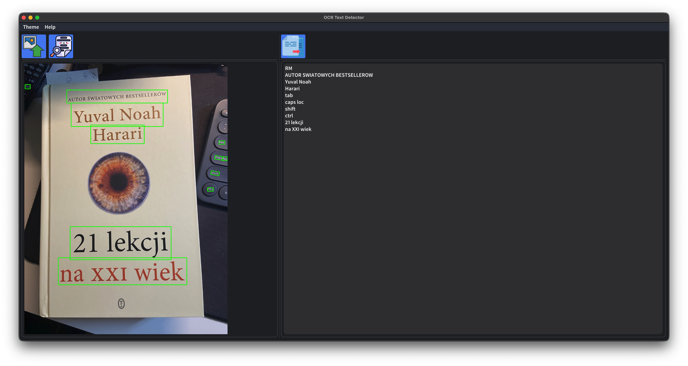

# OCR Text Detector

A desktop application for detecting and extracting text from images using OCR (Optical Character Recognition). Built with Python, EasyOCR, OpenCV, and DearPyGui.


## Features

- **Text Detection** — Automatically detects text regions in images
- **Visual Highlighting** — Draws green outlines around detected text
- **Text Extraction** — Extracts and displays detected text grouped by lines
- **Copy to Clipboard** — Easily copy extracted text with one click
- **Multiple Formats** — Supports PNG, JPG, and JPEG images

## Screenshots




## Installation

### Option 1: Windows Installer (Recommended)

1. Go to the [Releases](https://github.com/Kiryl19125/OCR_Text_Detector/releases) page
2. Download the latest `.exe` installer
3. Run the installer and follow the instructions
4. Navigate to the folder where you extracted the app and run the `.exe` file

### Option 2: Quick Start (Run from Source)

#### Prerequisites

- git (Version Control System)
- Python 3.10, 3.11 or 3.12
- pip (Python package manager)

1. **Clone the repository:**

```bash
git clone https://github.com/Kiryl19125/OCR_Text_Detector.git
cd OCR_Text_Detector
```

2. **Run the setup script:**

```bash
python setup.py
```
or
```bash
python3 setup.py
```

This will automatically create a virtual environment, install dependencies, and start the app.

### Option 3: Manual Setup (Run from Source)

#### Prerequisites

- git (Version Control System)
- Python 3.10, 3.11 or 3.12
- pip (Python package manager)

#### Steps

1. **Clone the repository:**

```bash
git clone https://github.com/Kiryl19125/OCR_Text_Detector.git
cd OCR_Text_Detector
```

2. **Create a virtual environment:**

```bash
python -m venv .venv
```
or 
```bash
python3 -m venv .venv
```

3. **Activate the virtual environment:**

- Windows:
```bash
.venv\Scripts\activate
```

- macOS/Linux:
```bash
source .venv/bin/activate
```

4. **Install dependencies:**

```bash
pip install -r requirements.txt
```

5. **Run the application:**

```bash
python main.py
```

## Usage

1. **Select Image** — Click the "Select Image" button to open a file dialog and choose an image
2. **Process Image** — Click "Process Image" to run OCR and detect text in the image
3. **Copy Text** — Click "Copy Text" to copy the extracted text to your clipboard

## Dependencies

- [EasyOCR](https://github.com/JaidedAI/EasyOCR) — OCR engine
- [OpenCV](https://opencv.org/) — Image processing
- [NumPy](https://numpy.org/) — Numerical computing
- [DearPyGui](https://github.com/hoffstadt/DearPyGui) — GUI framework
- [pyperclip](https://github.com/asweigart/pyperclip) — Clipboard operations
- [xdialog](https://github.com/mathgeniuszach/xdialog) — Native file dialogs

## Project Structure

```
OCR_Text_Detector/
├── config/
│   └── config.toml          # Application configuration
├── controller/
│   ├── __init__.py
│   └── controller.py        # Handles user interactions
├── model/
│   ├── __init__.py
│   └── model.py             # OCR processing logic
├── resources/
│   ├── fonts/               # Custom fonts
│   ├── icons/               # Application icons
│   ├── screenshots/         # App screenshots
│   └── test_images/         # Sample images for testing
├── view/
│   ├── __init__.py
│   ├── main_view.py         # UI layout
│   ├── tags.py              # UI element tags
│   └── themes.py            # UI themes
├── .gitignore
├── LICENSE
├── main.py                  # Application entry point
├── setup.py                 # Quick start script
├── README.md
└── requirements.txt
```

## License

This project is licensed under the MIT License - see the [LICENSE](LICENSE) file for details.